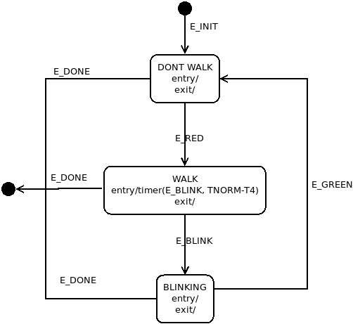

<!--
github push:
sign_and_send_pubkey: signing failed: agent refused operation
git@github.com: Permission denied (publickey).
fatal: Could not read from remote repository.
See ssh.sh:ssh_agent
-->

230227
======
Added a [meson](https://mesonbuild.com/) build/test file, much improved over Make.
I am running from a custom docker container with all the latest meson tools.

```
docker> meson --version
1.0.1
docker> meson setup bld_fsm
docker> cd bld_fsm
docker> meson compile --clean; meson compile -v
docker> meson test
```

Abstract
========
This project demonstrates how to create, manage, drive and regression test a
deterministic finite state machine (DFSM).  The motivation for
developing this code is as follows: 

* Many software-managed elements can be modelled using a theoretical state
  machine.
* Some Linux drivers and network code developed to control these elements have
  a software implementation of the DFSM.
* Many of the FSM implementations are very difficult to comprehend.  As a
  simple example of this: study `$K/include/net/tcp_states.h` and calls to
  `tcp_set_state` (`$K/net/ipv4/tcp.c`). Try to match the FSM defined in 
  [RFC-793:TCP](https://tools.ietf.org/html/rfc793) with the code.  It is
  possible but difficult.
* TCP has a fairly simple FSM. Some Telecom chipsets have much
  more complex FSMs or multiple FSMs cooperating to fulfill a mission. These
  FSMs can be fragile and hard to debug.
  
There are two substantial efforts under this project.

1. Develop a simple, reliable event delivery framework to/from
   a set of POSIX "worker" threads.
   
2. Use the event delivery framework to drive two cooperating FSMs:
   a stoplight and a corresponding crosswalk.  The events will primarily be
   based on timer expiration (e.g. read light timeout.) 
   Additionally there is an ondemand button to trigger a red light and
   "walk" crosswalk.
   
I made a good number of architecture decisions in developing the code after
investigations documented in 
[Alternative API Research](#alternative-api-research). 
Some alternate patterns are fruit for future research.

Project Documentation
---------------------
This **README** is the primary project documentation.

All C/Makefile/script software for this project is version-controlled at
[github:dturvene FSM](https://github.com/dturvene/finite-state-machine)

The source code is heavily documented using the 
[Kernel Doc](https://www.kernel.org/doc/html/v5.1/doc-guide/kernel-doc.html)
syntax.
   
FSM Overview
============
An FSM is essentially a set of states, each accepting a subset of all FSM
events.  For each state, an event causes a reaction that may transition to a
new state. An event not accepted by the current state will either be discarded
or cause an error.

This FSM model is based on [OMG UML v2.5.1][] specification, a comprehesive
(800 page!) description of all aspects of the Unified Modeling Language.  From
UML Chapter 1:

```
The objective of UML is to provide system architects, software engineers, and
software developers with tools for analysis, design, and implementation of 
software-based systems as well as for modeling business and similar processes.
```

I will focus Chapter 14 **State Machines** and even then not implement much of
the described behavior.  Additionally Chapter 16 **Actions** and Section 13.3
**Events** are implicitly used in this document to describe the FSMs.

The basic requirements for the FSMs implemented in this project are:

* simple to understand and interpret events/transitions,
* deterministic,
* relatively easy to modify and debug,
* capable of quickly unit and regression testing.

One design decision I made is to send all events to all FSMs to simplify
the event delivery framework. Thus an FSM that generates an event will also
receive it. If it is in state to accept the event then the transition logic
will be run, otherwise the event will be discarded.  Using the `DBG_DEEP`
verbosity (`-d 0x20`), a   `NO match` debug message will be generate by the FSM
logic.

Each Transition (UML 14.2.3.8) is a struct of:

* current state
* event
* transition guard constaint function
* next state

As described in UML 14.2.3.8.3, a transition may have a guard condition. This
boolean condition will allow the transition to proceed if the function returns
`true` and deny it if `false`. If the guard condition returns `false` the
transition to the next state will not proceed and the event will be
discarded.

Each State (UML 14.2.3.4) is a struct of:

* char name
* entry_action function (UML 14.2.3.4.5)
* exit_action function (UML 14.2.3.4.6)

The “char name” is debugging. The `entry_action` is a function called when the 
state is entered and the `exit_action` is a function called when the state is
being left (transition to a new state.) These functions are small: generally
sending an event or (re)setting a timer. An action function cannot block the
thread. 

Tying the structures together, the FSM is defined as a table of
Transitions. The generic FSM run logic will match the tuple (current state,
event id) to an entry in the FSM table and call the appropriate logic. As
mentioned above, if that tuple does not exist then the FSM will stay in the
current state and discard the event.

Finally, the FSMs in this project are a proper subset of UML 14. There is a
great deal more complexity to the UML State, Transaction, Action classes than
represented in this project (e.g. history, substates and enhanced actions.)
However, these extensions create a more difficult software implementation of
the FSMs and not much general utility; they are for boundary patterns.

Glossary and Definitions
========================
* [C language](https://en.wikipedia.org/wiki/C_(programming_language))
* [CLI](https://en.wikipedia.org/wiki/Command-line_interface): Command Line Interface
* [DFSM](https://en.wikipedia.org/wiki/Deterministic_finite_automaton): 
  Deterministic Finite State Machine
* `$K`: the root of the Linux kernel source tree

Software Overview
=================
The [FSM Overview](#fsm-overview) chapter gives a high-level view of the code
structure. Here are some specifics:

The code in `fsm.[ch]` is the generic code for an FSM, including a
call to `fsm_run` to drive the FSM given an input event.

The code in `fsm_defs.h` contains the definition for the stoplight and
crosswalk FSMs along with the (simple) `entry_action`, `exit_action` and
`constraint` functions.  It also contains the definitions for the timers used
by these two FSMs.

Software APIs
-------------
As mentioned earlier, for this project I am focusing on the Linux kernel and
device drivers.  The code is developed in C and, where possible, mimics the 
[Linux kernel API](https://www.kernel.org/doc/html/v5.11/core-api/kernel-api.html).
Where a suitable kernel API was not possible, the software uses
[POSIX](https://pubs.opengroup.org/onlinepubs/9699919799/) APIs.

The APIs used in this project include the following.

* The linked list uses the `libnl3/netlink/list.h` macros, which are a
  replica of the macros in [kernel list management][]
  implemented in `$K/include/linux/list.h`.
* `pthread_` and `pthread_cond_` calls as defined in [POSIX threads][]
  are roughly comparable to the kernel `kthread_` and `wait_event_` APIs
  described in 
  [Kernel Basics](https://www.kernel.org/doc/html/v5.1/driver-api/basics.html)
* `pthread_mutex_` calls are comparable to the mutex APIs documented in
  [kernel locking](https://www.kernel.org/doc/html/v5.1/kernel-hacking/locking.html)

evtdemo
-------
The first program, `evtdemo.c`, is an event delivery framework based on a
producer/consumer architecture.  There are four threads:

1. **MGMT** is the main process of the event framework to start/stop the FSMs and
   send events to them. It has no states.  It can generate the following events
   either from the keyboard or a script file.
   
2. **C1** is consumer thread receiving events from MGMT

3. **C2** is a consumer thread receiving events from MGMT

4. **TSRV** is the timer service.

The **MGMT** thread has no states but can generate on-demand events from a user
interface or script file 
([Unit and Regression Testing](#unit-and-regression-testing)).

**TSRV** is a service used by the other threads to create/manage timers and timer
events.  Workers create and set timers with the **TSRV** thread using the
`fsmtimer` API.  Note that the `fsmtimer` API has an internal mutex to protect
against race conditions.

When a timer expires, the **TSRV** delivers the corresponding event to all
worker threads.  **TSRV** uses the Linux
[epoll](https://man7.org/linux/man-pages/man7/epoll.7.html) and
[timerfd](https://man7.org/linux/man-pages/man2/timerfd_create.2.html)
APIs to implement timers. It can support a maximum of four concurrent timers.

See the inline documentation for more information.

fsmdemo
-------
This program implements two interworking FSMs using the event delivery
framework in [evtdemo](#evtdemo).  The major difference is the two consumers
threads are replace with FSM implementations:

* **C1** is replaced with **FSM1**, the thread for the traffic stoplight.
* **C2** is replaced with **FSM2**, the thread for the crosswalk.

FSM1 (stoplight) UML state diagram
----------------------------------


FSM1 Implementation
-------------------
The code for FSM1 is below. There are five states, each with an enter and exit
action. Each state has one or more transitions in the FSM1 transition table.

```
/* Default states */
fsm_state_t s_init = {"S:INIT", act_enter, act_exit};
fsm_state_t s_done = {"S:DONE", act_done, NULL};
/**
 * FSM1, stoplight
 */
fsm_state_t s_stoplight_init = {"S:INIT", stoplight_init_enter, act_exit};
fsm_state_t s_red = {"S:RED", red_enter, act_exit};
fsm_state_t s_green = {"S:GREEN", green_enter, act_exit};
fsm_state_t s_yellow = {"S:YELLOW", yellow_enter, act_exit};
fsm_state_t s_green_but = {"S:GREEN_BUT", green_but_enter, act_exit};
fsm_trans_t FSM1[] = {
 /* specific init for timers, transition to s_green */
 {&s_stoplight_init, E_INIT, NULL, &s_green},
/* GREEN */
 {&s_green, E_LIGHT, NULL, &s_yellow},
 {&s_green, E_DONE, NULL, &s_done},
 {&s_green, E_BUTTON, but_constraint, &s_green_but},
/* YELLOW */
 {&s_yellow, E_LIGHT, NULL, &s_red},
 {&s_yellow, E_DONE, NULL, &s_done},
/* RED */
 {&s_red, E_LIGHT, NULL, &s_green},
 {&s_red, E_DONE, NULL, &s_done},
/* GREEN BUT */
 {&s_green_but, E_LIGHT, NULL, &s_yellow},
 // TODO: NO DONE? {&st_green_but, E_DONE, &st_done},
};
```

The first transition is the init state `s_stoplight_init`. On entry it runs the
`stoplight_init_enter` function, which creates the timers and sets the values
(but does not start them!) In the `stoplight_init_enter` function notice that
timer `TID_LIGHT` is created to generate an `E_LIGHT` event. 

```
/**
 * stoplight_init_enter - init stoplight FSM
 *
 * When FSMs are started with E_INIT event, each is responsible to provision
 * itself.  This creates two timers: TID_LIGHT for changing the stoplight
 * and TID_BLINK for crosswalk blinking.  A set of timeout values are configured
 * as increments of the command line argument `tick`.
 * - t_norm: normal timeout for light change
 * - t_fast: timeout for yellow light, which is brief
 * - t_but: timeout for light when button is pressed
 * - t_blink: crosswalk blinking when stoplight is getting near S:GREEN
 */
static void stoplight_init_enter(void *arg)
{
 ACT_TRACE();
/* create timers with event on expiry */
 create_timer(TID_LIGHT, E_LIGHT);
 create_timer(TID_BLINK, E_BLINK);
/* update timer expiry periods to be adjustable */
 t_norm *= tick;
 t_fast *= tick; 
 t_but *= tick;
 t_blink *= tick;
}
```

Now look at the state `s_green` which has three transitions:

* `E_LIGHT`, where the next state is `s_yellow`
* `E_DONE`, where the next state is `s_done`
* `E_BUTTON`, where the next state is `s_green_but`

The UML diagram above illustrates the progress for each event.

We see from the init function that the `TID_LIGHT` timer is created but how is
it started? The timer start could have been added to the `stoplight_enter_init`
function but it is better to start it after the transition to `s_green` in its
entry function: 

```
/**
 * green_enter - broadcast event and set light timer for normal
 * timeout.
 */
static void green_enter(void *arg)
{
 ACT_TRACE();
 workers_evt_broadcast(E_GREEN);
 set_timer(TID_LIGHT, t_norm);
}
```

Using this pattern, the `TID_LIGHT` timer is (re)set to the desired value
regardless of which state the FSM transitions from. 

Almost every state has an `E_DONE` transition. This always enters the `s_done`
state which has only the `act_done` entry point, calling `pthread_exit` to end the
FSM thread. 

If a state does NOT have an `E_DONE` transition then the FSM cannot exit when in
that state, and will hang when the other threads exit. Use the SIGINT signal
(via keyboard ^C ) to exit the entire process. 

```
/**
 * act-done - when the E_DONE event is received, exit the thread immediately.  The main thread 
 * waits on pthread_join to reap the worker threads.
 */
static void act_done(void *arg)
{
 ACT_TRACE();
 pthread_exit(NULL);
}
```

FSM2 (crosswalk) UML state diagram
----------------------------------


From the FSM1 code fragments above, one can see an example of the `s_green`
state generating an `E_GREEN` event to all the FSMs. In FSM2 we see that an
`E_GREEN` event will cause a transition from the `s_blinking` state to the
`s_nowalk` state.

Alternative API Research
========================
These are some of the kernel and system mechanisms I investigated as
alternatives to the classic mutex/cond_wait and linked list APIs from above. 

The [FIFO](#fifo) and [reader-writer lock](#reader-writer-lock) are worthy of
more investigation to replace the current mutex/cond_wait implementation.

Events
------
I looked at the [libevent](http://libevent.org/) library for event handling,
which uses a registration/callback API.

Currently the event delivery code uses a simple queue based on a user-space
implementation of [kernel list management][] and `pthread_cond_` calls from
[POSIX threads][].  This is similar to some kernel event delivery mechanisms,
search on `enqueue` and `dequeue` for examples.  This mechanism is simple and
meets all requirements so I don't see changing it.

FIFO
----
I looked at using a
[Kernel FIFO Buffer](https://www.kernel.org/doc/html/v5.11/core-api/kernel-api.html#fifo-buffer)
implementation for the event interface to the FSM, probably with 
[mkfifo](https://man7.org/linux/man-pages/man3/mkfifo.3.html) or
[pipe](https://man7.org/linux/man-pages/man2/pipe.2.html).  The fifo and pipe
have locking internal to the API.

I chose to use kernel lists.  Either would suffice.

Reader-writer lock
------------------
An alternative to a mutex is the reader-writer lock, which would be good for this
one-way queue between threads.  The kernel API is
`$K/kernel/locking/qrwlock.c`.  It uses
[spinlock](https://en.wikipedia.org/wiki/Spinlock) and
[atomic operation](https://wiki.osdev.org/Atomic_operation)
to protect the queue.

The comparable pthread implementation is `pthread_rwlock_*`.  This is worth
explore for the next release.

<!--
https://docs.oracle.com/cd/E19455-01/806-5257/6je9h032u/index.html
https://docs.oracle.com/cd/E26502_01/html/E35303/sync-124.html
https://en.wikipedia.org/wiki/Readers%E2%80%93writer_lock
-->

Kernel workqueue
----------------
The 
[Kernel workqueue](https://www.kernel.org/doc/html/v5.11/core-api/workqueue.html) 
mechanism is attractive but too complex for the purpose of this project.

Kernel RCU
----------
The 
[Kernel RCU](https://www.kernel.org/doc/html/v5.11/RCU/index.html) mechanism is
another powerful API.  Essentially it protects concurrent access by
doing sequential Read, Copy, Update steps.  The idea is the writing task copies
the data structure while other tasks are reading it, modifies the data
structure copy and block new readers from accessing the original.  When all
current readers are done with the data structure, the writer replaces the
original structure with the copy then allowing reader task access to the
updated structure. 

This is more efficient than a lock, which blocks all access to the data
structure while it is being updated, because the RCU model allows readers
access the data structure while the copy is being modified.

The most notable user-space RCU library is [URCU](http://liburcu.org/).

As with the workqueue, RCU is too complex for the purpose of this project.

<!--
https://www.kernel.org/doc/html/v5.11/kernel-hacking/locking.html#avoiding-locks-read-copy-update
https://www.kernel.org/doc/html/v5.11/RCU/index.html
-->

FSM Unit and Regression Testing
===============================
The FSMs are entirely event driven, with event generation from timer expiry or
the CLI.  The CLI accepts a simple set of string commands from the user for
interaction with the FSMs.  The commands are one of:

* FSM event generation
* timer control
* FSM status
* Pause the CLI thread while the FSMs run

This is an effective mechanism to unit test the FSMs.

The FSMs can be regression tested by combining CLI commands into a script.
This is very helpful after source mods to quickly and accureately confirm that
the desired behavior is still valid.

The script works the same as the CLI but automatically. As the FSMs cycle
through state transitions, the script either pauses or retrieves
FSM status.  The script is passed as an argument to [fsmdemo](#fsmdemo) and
visually checked.  The scripts are commented to make the test steps
clearer.

Ideally I would wrap the FSM scripts in a python test script to verify that the
FSMs are in the correct state and the timers are set to the correct expiry
values.

Here is the `button.script` to regression test the button press support:

```
# test script to test button press
# ./fsmdemo -n -s button.script -t 100
# Test the button event

# send workers go event to run and nap
# light timer=t_norm(10*tick), state=S:GREEN
g n1 s

# button press, nap1, status
# light timer=t_but(1*tick), state=S:GREEN_BUT
b n1 s

# wait for going out of GREEN_BUT
# light timer=t_fast(3*tick), state=S:YELLOW
n3 s

# nap3, status
# light timer=t_norm(10*tick), state=S:RED,S:WALK
n3 s

# button, nap1, status
# light timer=t_norm(10*tick), state=S:RED,S:WALK
b n1 s

# nap5, nap5, status
# light timer=t_norm(10*tick), state=S:GREEN,S:DONT_WALK
n5 n5 s

# exit all threads and join
x
# script eof
```

<!--
References, cannot have trailing slash
-->
[kernel list management]: https://www.kernel.org/doc/html/v5.11/core-api/kernel-api.html#list-management-functions
[POSIX threads]: https://pubs.opengroup.org/onlinepubs/9699919799/xrat/V4_xsh_chap02.html#tag_22_02_09
[OMG UML v2.5.1]: https://www.omg.org/spec/UML/2.5.1
