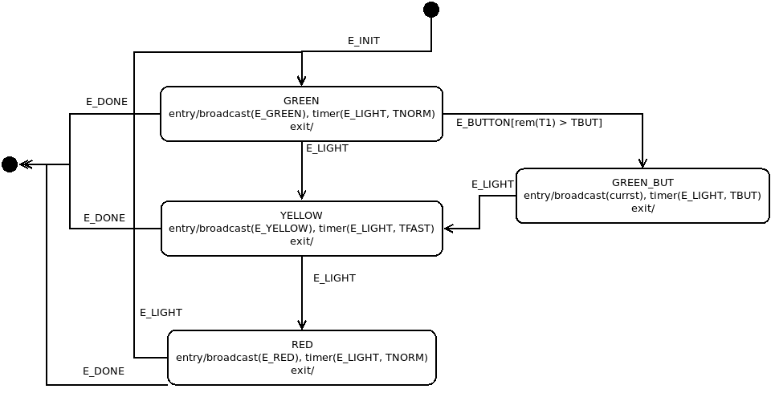

Abstract
========
This project demonstrates how to create, manage, drive and regression test a
deterministic finite state machine (DFSM).  The motivation for
developing this code is as follows: 

* Many software-managed elements can be modelled using a theoretical state
  machine.
* Some Linux drivers and network code developed to control these elements have
  a software implementation of the DFSM.
* Many of the FSM implementations are very difficult to comprehend.  As a
  simple example of this: study `$K/include/net/tcp_states.h` and calls to
  `tcp_set_state` (`$K/net/ipv4/tcp.c`). Try to match the FSM defined in 
  [RFC-793:TCP](https://tools.ietf.org/html/rfc793) with the code.
* TCP has a fairly simple FSM. Some Telecom chipsets have much
  more complex FSMs or multiple FSMs cooperating to fulfill a mission. These
  FSMs can be fragile and hard to debug.
  
There are two substantial efforts under this project.

1. The first is to develop a simple, reliable event delivery framework to/from
   a set of POSIX "worker" threads: [evtdemo](#evtdemo).
   
2. The second uses the event delivery framework to build the 
   [FSM Example](#fsm-example): [fsmdemo](#fsmdemo).
   
TODO
----
* describe each FSM as a pthread worker
* an event is delivered to all FSM workers.  This has the advantage of a single
  event-delivery function and all the logic of event handling is retained in
  the FSM definitions.
* UML State machine is good has a number of extensions for special case logic
  that causes it to become complex and difficult to implement.  The focus of
  this paper is a simple FSM.  If necessary, the complex logic is added to the
  enter and exit actions.
* FSM requirements: simple to understand, deterministic, minimal number of
  events generated/consumed.
* [UML](https://www.omg.org/spec/UML/2.2/Superstructure/PDF) too complex but
  the notation is useful to concisely document each FSM.
  
FSM Overview
============
A DFSM is essentially a set of states, each accepting a subset of all FSM
events.  Each event causes a reaction particular to that state.  An event not
accepted by the current state will either be discarded or cause an error.  It
is possible that an error will cause the FSM to generate an error event to
another FSM alerting it to a possible FSM bug.

. 
It is a good reference but, for the purpose of this project, too complex.  It
has a number of FSM extensions that strength the model but, in my opinion, 
confuse the theory.  For example, there is a **state** and a more powerful
**extended state**. The **extended state** can have a guard condition (which is
usually a static boolean or counter) that will allow/prohibit the transition to
the state. The effect of the guard condition is that an event WILL cause a
state transition or it WILL NOT. This breaks the definition of a DFSM.

Glossary and Definitions
========================
* [C language](https://en.wikipedia.org/wiki/C_(programming_language))
* [DFSM](https://en.wikipedia.org/wiki/Deterministic_finite_automaton): 
  Deterministic Finite State Machine
* `$K`: the root of the Linux kernel source tree

FSM Example
===========
The project uses a set of simple, interworking FSMs to illustrate the
concepts.  In this example, there are four threads:

1. `MGMT` is the main process of the event framework to start/stop the FSMs and
   send events to them. It has no states.  It can generate the following events
   either from the keyboard or a script file.
   
2. `FSM1` is the thread for the traffic stoplight.

3. `FSM2` is the thread for the crosswalk.

4. `TSRV` is the timer service.

The `MGMT` thread has no states but can generate on-demand events from a user
interface or script file.

`TSRV` is a service used by the other threads to create/manage timers and timer
events.  A worker creates and sets a timer with the TSRV thread using the
`fsmtimer` API.  The `fsmtimer` API has an internal mutex to protect against
race conditions.  When a timer expires, the `TSRV` delivers the corresponding
event to all worker threads.

Each FSM worker thread is built around a unique FSM state table, described
below using the State Machines Notation from 
[OMG UML v2.5.1](https://www.omg.org/spec/UML/2.5.1/).

The FSM mechanisms use a small subset of features in the State Machines chapter
of [OMG UML v2.5.1](https://www.omg.org/spec/UML/2.5.1/). However, all the
features of each FSM are defined in the UML doc.

Each FSM is structured as a table of tuples: current state, event, new state.
Each state has an entry action and an exit action.

As described in [OMG UML v2.5.1]() paragraph 14.2.4.8, a transition (event) may
have a guard condition. This boolean condition will allow the transition if
`true` and deny it if `false`.  In otherwords, if the guard condition returns
`false` the transition to the next state will not be completed and the event
will be discarded.

FSM1 (stoplight) state diagram
------------------------------

FSM1 (crosswalk) state diagram
------------------------------

Software Overview
=================
Per the [Abstract](#abstract), I am focussing on the Linux kernel and device
drivers.  The code is developed in C and, where possible, mimics the 
[Linux kernel API](https://www.kernel.org/doc/html/v5.11/core-api/kernel-api.html)
Where a suitable kernel API was not possible, the software uses
[POSIX](https://pubs.opengroup.org/onlinepubs/9699919799/)
APIs.

The APIs used in this project include the following.

* The linked list use the `libnl3/netlink/list.h` macros, which are a
  replica of the macros in
  [kernel list management](https://www.kernel.org/doc/html/v5.11/core-api/kernel-api.html#list-management-functions)
  and implemented in `$K/include/linux/list.h`.
* `pthread_`, `pthread_cond_` calls as defined in
  [POSIX threads](https://pubs.opengroup.org/onlinepubs/9699919799/xrat/V4_xsh_chap02.html#tag_22_02_09)
  are roughly comparable to the kernel `kthread_` and `wait_event_` APIs
  described in 
  [Kernel Basics](https://www.kernel.org/doc/html/v5.1/driver-api/basics.html)
* `pthread_mutex_` calls are comparable to the mutex APIs documented in
  [locking](https://www.kernel.org/doc/html/v5.1/kernel-hacking/locking.html)
  
Alternative Implementations
===========================
These are some of the kernel mechanisms I investigated as alternatives to the
classic `mutex/cond_wait` and linked list APIs from above.  The [FIFO](#fifo) and
[reader-writer lock](#reader-writer-lock) are worthy of more investigation to
replace the current `mutex/cond_wait` implementation.

FIFO
----
I looked at using a
[Kernel FIFO Buffer](https://www.kernel.org/doc/html/v5.11/core-api/kernel-api.html#fifo-buffer)
implementation for the event interface to the FSM, probably with 
[mkfifo](https://man7.org/linux/man-pages/man3/mkfifo.3.html) or
[pipe](https://man7.org/linux/man-pages/man2/pipe.2.html).  The fifo and pipe
have locking internal to the API.

I chose to use kernel lists.  Either would suffice.

Reader-writer lock
------------------
An alternative to a mutex is the reader-writer lock, which would be good for this
one-way queue between threads.  The kernel API is
`$K/kernel/locking/qrwlock.c`.  It uses
[spinlock](https://en.wikipedia.org/wiki/Spinlock) and
[atomic operation](https://wiki.osdev.org/Atomic_operation)
to protect the queue.

The comparable pthread implementation is `pthread_rwlock_*`.  This is worth
explore for the next release.

<!--
https://docs.oracle.com/cd/E19455-01/806-5257/6je9h032u/index.html
https://docs.oracle.com/cd/E26502_01/html/E35303/sync-124.html
https://en.wikipedia.org/wiki/Readers%E2%80%93writer_lock
-->

Kernel workqueue
----------------
The 
[Kernel workqueue](https://www.kernel.org/doc/html/v5.11/core-api/workqueue.html) 
mechanism is attractive but too complex for the purpose of this project.

Kernel RCU lock
---------------
The 
[Kernel RCU](https://www.kernel.org/doc/html/v5.11/RCU/index.html) mechanism is
another powerful API.  Essentially it protects concurrent access by
doing sequential Read, Copy, Update steps.  The idea is the writing task copies
the data structure while other tasks are reading it, modifies the data
structure copy and block new readers from accessing the original.  When all
current readers are done with the data structure, the writer replaces the
original structure with the copy then allowing reader task access to the
updated structure. 

This is more efficient than a lock, which blocks all access to the data
structure while it is being updated, because the RCU model allows readers
access the data structure while the copy is being modified.

The most notable user-space RCU library is [URCU](http://liburcu.org/).

As with the workqueue, RCU is too complex for the purpose of this project.

<!--
https://www.kernel.org/doc/html/v5.11/kernel-hacking/locking.html#avoiding-locks-read-copy-update
https://www.kernel.org/doc/html/v5.11/RCU/index.html
-->

Project Documentation
=====================
This **README** is the primary project documentation.

The source code is heavily documented using the 
[Kernel Doc](https://www.kernel.org/doc/html/v5.1/doc-guide/kernel-doc.html)
syntax.

evtdemo
=======
The first program, `evtdemo.c` is an event delivery framework based on a
producer/consumer architecture.  MGMT sends `fsm_events` to two worker threads.
Each worker thread will call the TSRV API to create and start one or more
timers managed by the TSRV thread.

The `TSRV` thread uses the Linux
[epoll](https://man7.org/linux/man-pages/man7/epoll.7.html) and
[timerfd](https://man7.org/linux/man-pages/man2/timerfd_create.2.html)
APIs to implement timers. It can support a maximum of four concurrent timers.

See the inline documentation for more information.

fsmdemo
=======
This program implements the [FSM Example](#fsm-example) using the `evtdemo.c`
framework.

